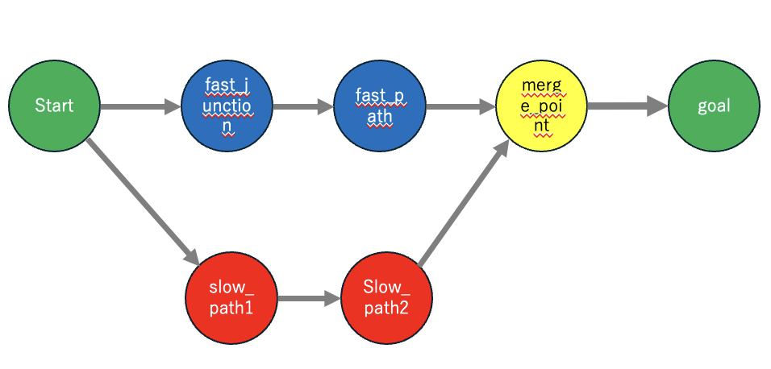
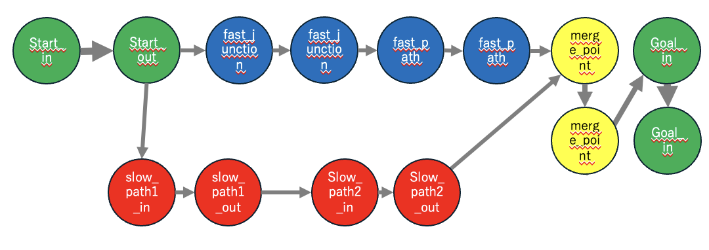
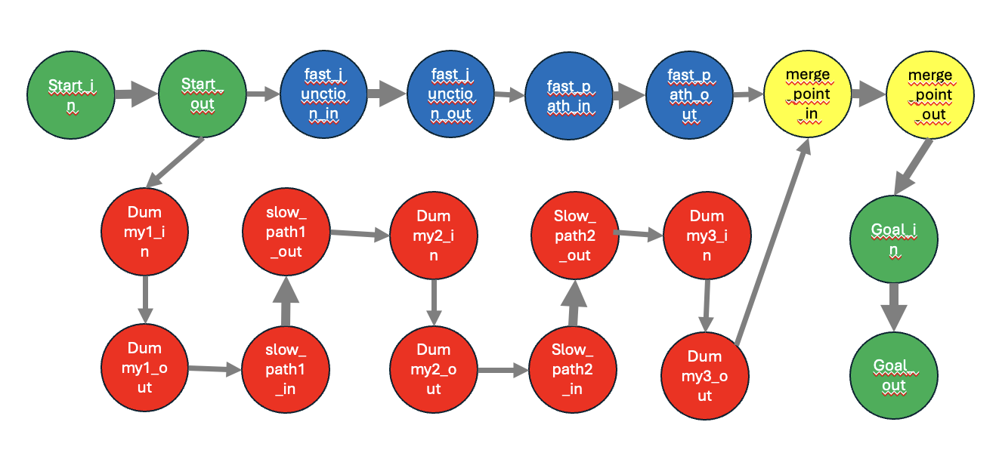
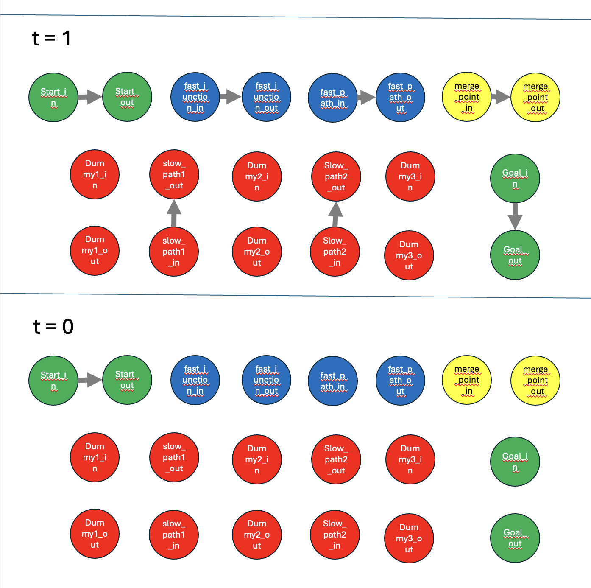
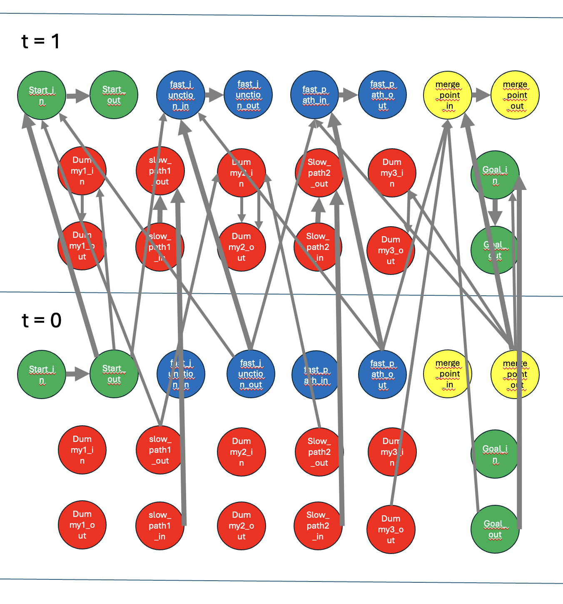
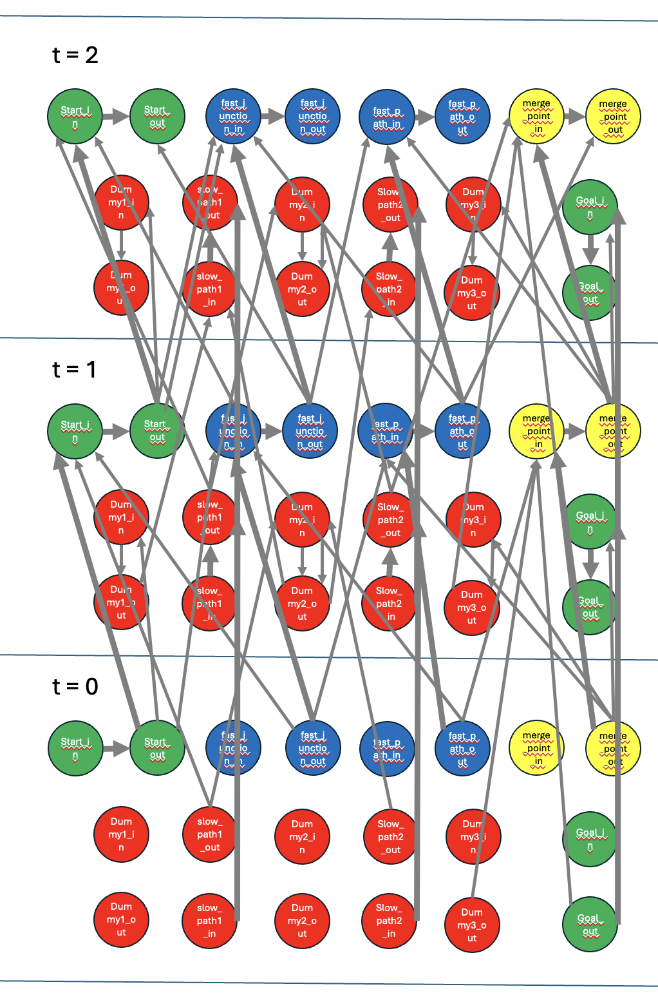
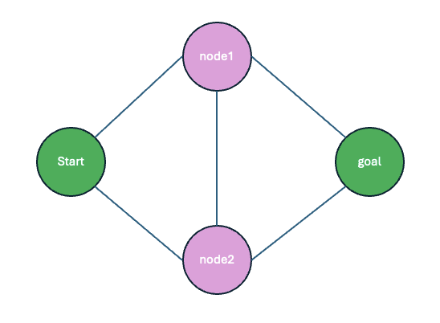

# Fly-in
## Description
*Fly-in*は、42cursusのMilestone3のソロ課題です。スタートから同時に複数のドローンを出発させ、効率よく全てのドローンがゴールまで辿り着く経路を探す課題です。マルチエージェントでの経路探索、最大流問題などについて学べます。
### マップの形式
以下のような形式でmap情報が与えられます。

```
nb_drones: 5
start_hub: start 0 0 [color=green]
end_hub: goal 10 10 [color=yellow]
hub: node 5 5[zone=restricted color=red]
connection: start-node [max_link_capacity=2]
connection: node-goal
```
ルールは以下の通りです。
1. 最初のラインは`nb_drones`: ドローンの数を指定しなければなりません。
2. `start_hub`, `end_hub`, `hub: name x y [metadata]でhub(ノード)の情報を指定します。
3. hubのmetadataは以下のルールに沿っています。  
zone=type(default: normal): typeが`normal`なら、スタンダードなhubで、移動には1ターンかかる。`blocked`なら、そのzoneへは侵入禁止。`restricted`なら、移動には2ターンかかる。`priority`なら、移動には1ターンかかり、優先的に経由しなけらばならない。　　
color=value(default: none): hubの色.  
max_drones=number(degfault: 1): hubに同時に留まれるドローンの最大数
3. `connection`: name1-name2 [metadatta]でname1とname2のハブのつながりを表す
4. connectionのmeatadataにつて、以下のルールがある。   
max_link_capacity=number(default: 1): そのエッジ同時に通過できるドローンの最大数。

## Instruction
以下の手順で実行してください。
```bash
# リポジトリからのクローン
git clone https://github.com/takutotakuto1121-creator/Fly-in.git Fly-in

# リポジトリへの移動
cd Fly-in

# 実行
make run
```
logのみをターミナルに出力したい場合は以下のコマンドで実行できます。
```bash
make log
```

## Algorithm
### Parseについて
mapの情報が記述されたテキストファイルをパースします。
pydanticを用いてバリデーションしながらパースしていますが、メインは経路探索とビジュアライズなので割愛します。コードを見ればすぐにわかります。

### 時空間を繋いだ最大流問題
最大流問題に時空間の概念を取り入れて実装しています。最大流問題とは、グラフが与えられ、そこに流すことのできる水の最大量を求める問題です。解説は[こちらのサイト]()に任せます。また、経路探索には[DFS]()を用いています。具体例を用いて解説します。例えば、以下のようなmapが与えられたとします。(maps/medium/03_priority_puzzle.txtのマップ)
```
# Medium Level 3: Priority zones create optimal path challenges
nb_drones: 5

start_hub: start 0 0 [color=green]
hub: slow_path1 1 -1 [zone=restricted color=red]
hub: slow_path2 2 -1 [color=red]
hub: fast_junction 1 0 [zone=priority color=blue max_drones=2]
hub: fast_path 2 0 [zone=priority color=blue]
hub: merge_point 3 0 [color=yellow max_drones=3]
end_hub: goal 4 0 [color=green]

connection: start-slow_path1
connection: start-fast_junction
connection: slow_path1-slow_path2
connection: slow_path2-merge_point
connection: fast_junction-fast_path
connection: fast_path-merge_point
connection: merge_point-goal [max_link_capacity=2]

```
このグラフを可視化すると以下のようになります。少し太いエッジ(merge_point -> goal)のみ、ドローンが同時に2機通過可能です。また、通常エッジを通ってノードからノードに移動するのには1ターンしかかかりませんが、restrictedのslow_path1, slow_path2に行くには、2ターンかかります。今回はありませんが、blockedのノードが存在する場合は、この時点でノードを生成せず、存在を抹消しておきます。



まず、各ノードに対して同時に存在可能なドローン数を考慮しながらプログラムをすると非常に複雑になっってしまうので、各ノードをinとoutのノードに分割します。inとoutを結ぶエッジの同時に通行可能なドローン数には、十分に大きい数を割り当てておきます。これにより、考慮すべき条件が一つ減りました。グラフは以下です。



もう一つ条件を減らします。restrictedのslow_path1, slow_path2に移動する際は間にダミーのノードを挟んで、ダミーノード間の同時に移動可能なドローン数とノードに同時に存在可能なドローン数を対応させます。今回はshow_path1, show_path2ともに1なので、1にしておきます。以上、全てのノードは同等に扱え、考慮するのはエッジの通行可能ドローン数のみになります。条件がスッキリしました。グラフは以下です。



このグラフにおいて、複数ドローンをstart_inから出発させ、全てのドローンがgoal_outに最短手数でたどり着けるようなアルゴリズムを組んでいきます。
まずは時間t(tは0以上の整数)で各時間のグラフを考えましょう。tがひとつ増える毎にターンは1だけ増えます。
初期状態では、エッジは無しにして、ノードのみが存在する状態にします。
t=0では、start_in -> start_goalのエッジのみを作成します。
t=1では、各ノード(dummyノードを除く)のin -> outのエッジのみを作成します。
以下のようなグラフになります。
ついでにt=0の状態でDFSを行す。当然goalに辿り着く経路は存在しませんね。



この時点では、t=0とt=1のグラフ異なる時空間に存在します。各グラフは独立していて、交わることはありません。
経路探索の方法について、エージェント(今回はドローン)が一体のみだと、適当にBFS,ダイクストラでもやっておけば最短経路は求まりますが、今回はマルチエージェント(ドローンが複数)なので、普通に経路探索をしていては、求めることが非常に困難になります。
これを解決するために、異なる時空間同士を結合させる手法で実装しました。以下のグラフは2次元ですが、3次元でt=0,t=1が縦に並んでいるような想像をするとわかりやすいかもしれません。
t=0からt=1へ移動することは、ターンが１ターン進行するということです。そのため、t=0からt=1に進むタイミングでノード間の移動ができるようにしています。
ドローンが1ターン進む毎にする行動には、待機と移動が存在します。
待機について、t=0でのstart_out(以下start_out(t=0)の表に表現)とstart_in(t=1)をエッジで繋ぎます。同様に各ノードのin(t=0) -> out(t=1)のエッジを作成します。これはターンの経過でドローンが移動せずにそのノードに留まる待機と同じ操作になります。
移動について、まずは通常のノード同士のエッジを考えます。例えばfast_junction->fast_pathを参照してください。fast_junction_out(t=0) -> fast_path_in(t=1), fast_path_out(t=0) -> fast_junction(t=1)のエッジを作成します。これにより1ターンでの双方向での移動が可能になります。
次に移動先がrestrictedのノードの場合を考えます。例えばstart->slow_path1を参照してください。start_out(t=0) -> dummy1_in(t=1), dummy1_in(t=1) -> dummy1_out(t=1), slow/path(t=0) -> satrt_in(t=1)のエッジを作成します。ダミーのーどを間に挟んでいるのがポイントです。なぜこれで1ターン遅れさせれるのかについては後述のt=2まで行った状態の解説を参照してください。
最後に移動元がrestrictedのノードの場合を考えます。例えばslow_path2 -> merge_pointを参照してください。slow_path2_out(t=0) -> merge_point(t=1), merge_point(t=0) -> dummy3_in(t=1), dummy3_in(t=1) -> dummy3_out(t=1)のエッジを作成します。同様にダミーのーどを挟んでいるのがポイントです。
このt=0, t=1を繋げた空間で、スタートをstart_in(t=0),　ゴールをgoal_out(t=1)として、DFSを行いましょう。まだ経路は見つかりません。



あとは以上の操作を繰り返していくだけです。
以降で一点だけ異なるのが、restrictedのノードが関係する部分のエッジ作成において、今回だとdummy_1_out(t=1) -> slow_path1_in(t=2)などのダミーノードとrestrictedのノードを繋ぐエッジが追加されている点です。ここまでいって初めてrestrictedのノードへの移動が可能になります。以上の操作によってrestrictedのノードに2ターンかけて移動できるようになっています。
t=0,1,2を繋げた空間でまたBFSを行います。今回のスタートはstart_in(t=0)で、ゴールはgoal_end(t=2)です。まだ経路は見つかりません。



この操作を繰り返すことによって、少しずつ空間を拡張していきながら、ターン毎の移動を実現し、経路を探索していきます。t=tの時、スタートはstart_in(t=0), ゴールはgoal_end(t=t)になります。

## DFSによるマルチエージェントの経路探索
繰り返すといずれDFSによって経路が見つかるようになります。ただここまでだとエージェント(ドローン)数が1です。では、マルチエージェント(エージェント数が2以上)で経路を探索する方法について考えていきます。
マップについて改めて考えましょう。一番最初のノードのin, outへの分割、restrictedのノードへの移動の際にダミーのーどを挟む操作により、考慮すべきデータははノード、エッジ、各エッジの一度に通行可能なドローンの最大数の3点になりました。
各エッジの一度に通行可能なドローンの最大数に着目します。`mapf.py`では、以下のようにEdgeクラスを定義しています。
```python
class Edge:
    def __init__(self, to_node: tuple[str, str, int], cap: int, is_forward: bool):
        self.to: tuple[str, str, int] = to_node
        self.cap: int = cap
        self.rev: Optional[Edge] = None
        self.is_forward: bool = is_forward
```
各エッジには、to: エッジの差すノード、cap: エッジを一度に通行可能なドローンの最大数、rev: 反対むきのEdge(キャンセルルート), is_forward: このエッジは順方向のエッジかどうか（キャンセルルートではないか）の情報が含まれています。
capが重要です。ターンの遷移(tの遷移)時に、DFSの探索中にドローンが待機ではなく移動した時のことを考えます。エッジを使って移動しますが、まず一度DFSを行い最短経路を見つけると、使ったエッジのcapを-1して、revのcapを+1していきます。次にどの状態でもう一度DFSを行うということを繰り返していきます。これを経路が発見できなくなるまで繰り返し、発見した経路数がドローンの数以上になれば終了します。
revのcapを+1するということは、1つのドローンがスタートからゴールまでの経路を見つけると、そのルートの真逆の経路をエッジを利用して追加するということです。
原点に立ち返ると、最大流問題を応用して解くという方針でした。最大流問題では、流せるだけ水を流します。ただ、以下のグラフを考えます。



このグラフのstartからgoalに最大限水を流すと、node1 - node2のエッジで水が衝突し、流れなくなります。そのため、水が流れる経路はstart->node1->goal, start->node2->goalの2通りになるはずですが、探索すると、例えば１回目の探索でstart->node1->node2->goalの経路を見つけてきたとします。すると、start->node1, node1->node2, node2->goalのcapを1から0に変更し、普通にもう一度探索を行うと、経路は見つかりません。これは、水の衝突を考慮してないからです。

先ほど見つけてきたルートの逆ルート(キャンセルルート)を作成してからもう一度探索を行うことにします。goal->node2->node1->startのキャンセルートを追加し、探索を行うと、start->node2->node1->goalの経路を発見できます。
以上のようにキャンセルルートを作成しておくと、経路がしっかりと2つ見つかりました。
見つけてきた2つの経路は
start->node1->node2->goal, 
goal->node2->node1->start
の２つです。
正解の経路は
start->node1->goal, 
start->node2->goal
です。比較してください。すると見つけてきた経路では、node1-node2のエッジで衝突しているものの、すれ違ってそのまま探索をしています。
この挙動をうまく修正すれば正解のルートが得られそうですね。

本来なら水が衝突してnode-node2は通れないはずです。見つけてきたルートは衝突していません。ただ、衝突時に水を交換するような操作をすると、衝突と同じ挙動を再現できます。
start->node1->node2->goalで、node1->node2へは行かずに、もう一つのキャンセルルートを使用した経路start->node2->node1->goalのnode2->node1へ行った水と交換します。
すると、経路はstart->node1->goal, start->node2->goalの2２通りになり、正解の経路と一致しました。
以上のようにキャンセルルートを作成する操作をDFSに追加し、DFSを繰り返すことにより、マルチエージェントに対応した複数形をを見つけてくることができます。

ちなみに、ターンが最小であればよく、各エージェントの経路は最短でなくてもよく、経路があればそれを見つけてくればいいだけなので、BFSでもダイクストラでもA*でも、どんなアルゴリズムを用いて経路探索をしても構いません。

### pygameによるビジュアライズ
製作中です。

## Resouces
### AIの使用について
コードの基盤は全て手書きで実装しています。
flake8, mypyエラーの解消にはAIを使用しました。
### 参考文献
aaa


